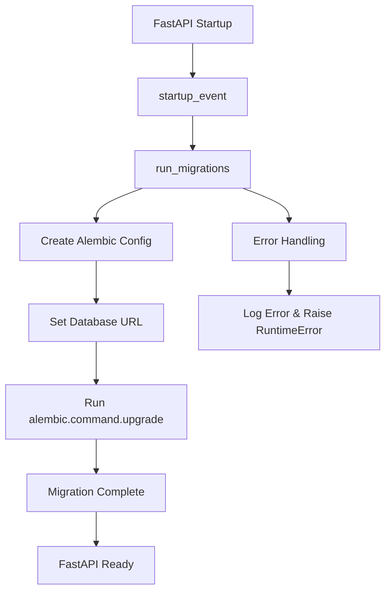

# Alembic Migration Fix - Technical Specification

## Problem Analysis

### Root Cause
The FastAPI application fails to start with the error:
```
AttributeError: module 'alembic.context' has no attribute 'config'
```

### Issue Breakdown
1. **Context Access at Import Time**: `env.py:17` tries to access `context.config` when the module is imported
2. **Missing Alembic Context**: The Alembic context is only available when running through Alembic's framework
3. **Incorrect Config Path**: `startup.py:20` has an incorrect path calculation for alembic.ini
4. **Direct Import Issue**: Current approach imports env.py directly without proper Alembic context initialization

## Solution Architecture

### Approach: Separate Migration Runner with Proper Context Initialization

We will create a migration runner that properly initializes the Alembic context before executing migrations, avoiding direct imports of env.py.

## Implementation Plan

### 1. Fix Alembic Configuration Path
**File**: `src/fastapi_playground_poc/startup.py`
**Issue**: Line 20 has incorrect path calculation
**Current**: 
```python
config_path = Path(__file__) / "persistence" / "alembic.ini"
```
**Fix**: 
```python
config_path = Path(__file__).parent / "persistence" / "alembic.ini"
```

### 2. Refactor env.py to Defer Context Access
**File**: `src/fastapi_playground_poc/persistence/migrations/env.py`
**Issue**: Line 17 accesses `context.config` at import time
**Current**:
```python
config = context.config
```
**Fix**: Move this inside functions that are called by Alembic framework

### 3. Create Proper Migration Runner
**File**: `src/fastapi_playground_poc/startup.py`
**Approach**: Use Alembic's programmatic API with proper context initialization

#### New Implementation Strategy:
1. Use `alembic.command.upgrade()` for programmatic migrations
2. Create proper Alembic Config object with correct paths
3. Set up environment variables and database URL
4. Handle async database connections properly

### 4. Updated Migration Execution Flow



## Detailed Code Changes

### 1. Updated startup.py
```python
"""Dedicated startup module for running migrations before the app starts accepting requests."""

import asyncio
import logging
import sys
from pathlib import Path

# Add src to path so alembic can find our modules
src_path = Path(__file__).parent.parent
sys.path.insert(0, str(src_path))

# Import alembic
from alembic.config import Config
from alembic import command
from fastapi_playground_poc.config import settings

logger = logging.getLogger(__name__)


def get_alembic_config() -> Config:
    """Get alembic configuration with proper paths."""
    # Fix: Use .parent instead of direct path concatenation
    config_path = Path(__file__).parent / "persistence" / "alembic.ini"
    
    if not config_path.exists():
        raise FileNotFoundError(f"Alembic config not found at {config_path}")
    
    config = Config(str(config_path))
    
    # Set the database URL from settings
    db_url = settings.database_url
    config.set_main_option("sqlalchemy.url", db_url)
    
    return config


async def run_migrations() -> None:
    """Run database migrations using alembic's programmatic API."""
    logger.info("Starting database migration check...")
    
    try:
        # Get alembic configuration
        config = get_alembic_config()
        
        # Run migrations to head (latest)
        # This approach properly initializes Alembic context
        def run_upgrade():
            command.upgrade(config, "head")
        
        # Run in executor to avoid blocking async event loop
        loop = asyncio.get_event_loop()
        await loop.run_in_executor(None, run_upgrade)
        
        logger.info("Database migrations completed successfully")
        
    except Exception as e:
        logger.error(f"Failed to run migrations: {type(e).__name__}: {e}")
        raise RuntimeError("Database migrations failed - cannot start application") from e


async def startup_event() -> None:
    """FastAPI startup event handler that runs migrations."""
    logger.info("Performing startup tasks...")
    
    try:
        await run_migrations()
        logger.info("Startup tasks completed successfully")
    except Exception as e:
        logger.error(f"Startup failed: {e}")
        raise


def sync_startup() -> None:
    """Synchronous wrapper for running migrations at startup."""
    logger.info("Running synchronous startup...")
    asyncio.run(startup_event())


if __name__ == "__main__":
    # Allow running migrations directly: python -m fastapi_playground_poc.startup
    logging.basicConfig(level=logging.INFO)
    sync_startup()
```

### 2. Updated env.py
```python
from logging.config import fileConfig
import logging
import asyncio
from sqlalchemy import pool, text
from sqlalchemy.ext.asyncio import create_async_engine
from alembic import context

# Import your models and Base
from fastapi_playground_poc.db import Base
from fastapi_playground_poc.models.User import User  # Import your models

# Add diagnostic logging
logger = logging.getLogger("alembic.env")

# target_metadata for autogenerate support
target_metadata = Base.metadata


def get_config():
    """Get the alembic configuration when context is available."""
    return context.config


def run_migrations_offline() -> None:
    """Run migrations in 'offline' mode."""
    config = get_config()  # Get config when function is called, not at import
    url = config.get_main_option("sqlalchemy.url")
    
    context.configure(
        url=url,
        target_metadata=target_metadata,
        literal_binds=True,
        dialect_opts={"paramstyle": "named"},
    )

    with context.begin_transaction():
        context.run_migrations()


def do_run_migrations(connection):
    """Helper function to run migrations with a connection."""
    config = get_config()  # Get config when function is called
    
    # Create schema if it doesn't exist
    logger.info("Ensuring test_app schema exists...")
    connection.execute(text("CREATE SCHEMA IF NOT EXISTS test_app"))
    logger.info("Schema test_app ensured")

    connection.commit()
    
    # Verify schema exists
    schema_check = connection.execute(
        text("SELECT schema_name FROM information_schema.schemata WHERE schema_name = 'test_app'")
    )
    schema_exists = schema_check.fetchone() is not None
    logger.info(f"Schema test_app exists: {schema_exists}")
    
    # Add diagnostic logging
    logger.info(f"Target metadata tables: {list(target_metadata.tables.keys())}")
    logger.info(f"Base metadata tables: {list(Base.metadata.tables.keys())}")

    # Log the User model table name
    from fastapi_playground_poc.models.User import User
    logger.info(f"User model tablename: {User.__tablename__}")

    context.configure(connection=connection, target_metadata=target_metadata)

    with context.begin_transaction():
        logger.info("Starting migration transaction...")
        context.run_migrations()
        logger.info("Migration transaction completed")


async def run_async_migrations():
    """Run migrations in async mode."""
    config = get_config()  # Get config when function is called
    logger.info("Starting async migrations")

    # Get database URL
    db_url = config.get_main_option("sqlalchemy.url")
    logger.info(f"Database URL: {db_url}")

    # Create async engine
    connectable = create_async_engine(
        db_url,
        poolclass=pool.NullPool,
        connect_args={"server_settings": {"search_path": "test_app"}},
    )

    logger.info(f"Target metadata: {target_metadata}")
    logger.info(f"Async engine created successfully: {connectable}")

    try:
        async with connectable.connect() as connection:
            logger.info("Async database connection established successfully")
            await connection.run_sync(do_run_migrations)
    except Exception as e:
        logger.error(f"Error during async database connection: {e}")
        logger.error(f"Error type: {type(e)}")
        raise
    finally:
        await connectable.dispose()


def run_migrations_online() -> None:
    """Run migrations in 'online' mode with async support."""
    logger.info("Starting run_migrations_online() with async support")
    asyncio.run(run_async_migrations())


if context.is_offline_mode():
    run_migrations_offline()
else:
    run_migrations_online()
```

## Testing Strategy

### 1. Unit Tests
- Test `get_alembic_config()` with valid and invalid paths
- Test migration runner error handling
- Mock alembic.command.upgrade for testing

### 2. Integration Tests
- Test full startup sequence with database
- Test migration execution with actual database
- Test error scenarios (missing config, database connection failures)

### 3. Manual Testing
- Start FastAPI application and verify no errors
- Check that migrations run successfully
- Verify database schema is created correctly

## Risk Assessment

### Low Risk Changes
- Path fix in startup.py (simple correction)
- Moving context access in env.py (safe refactor)

### Medium Risk Changes
- New migration execution approach (well-tested Alembic pattern)
- Async executor usage (standard asyncio pattern)

### Mitigation Strategies
- Comprehensive error handling and logging
- Fallback to original approach if needed
- Database backup before migration testing

## Rollback Plan

If the new approach fails:
1. Revert to subprocess-based alembic command execution
2. Use synchronous migration approach
3. Implement retry mechanism with exponential backoff

## Success Criteria

1. ✅ FastAPI application starts without migration errors
2. ✅ Database migrations execute successfully
3. ✅ All existing functionality remains intact
4. ✅ Proper error handling and logging
5. ✅ No breaking changes to existing migration files